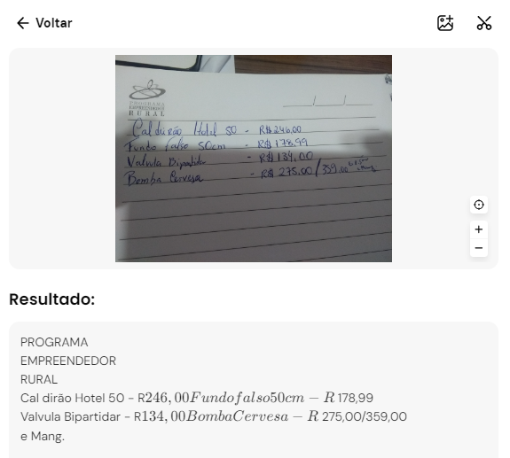
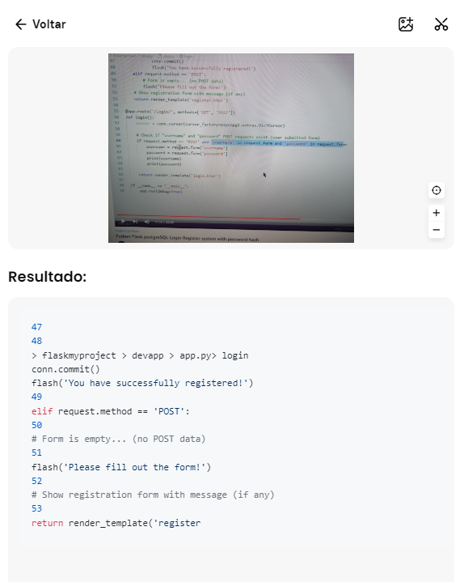
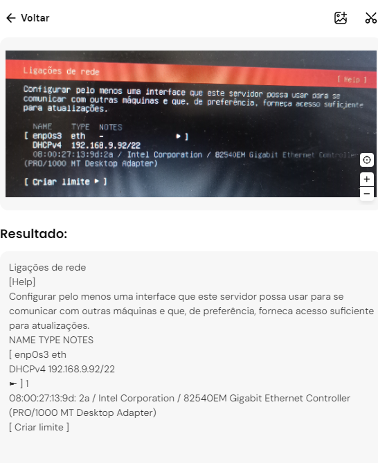
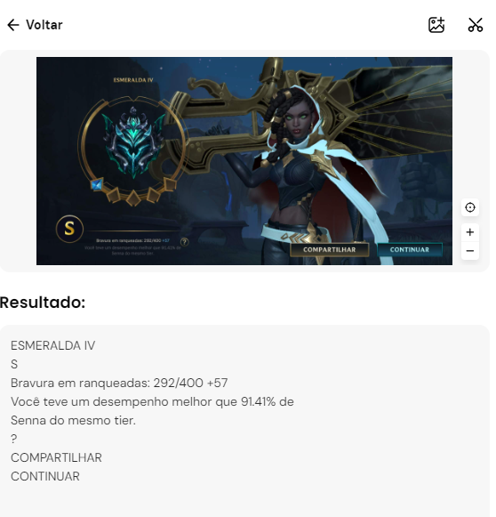

# Projeto de Reconhecimento de Texto em Imagens

Este repositório contém um projeto de reconhecimento de texto em imagens, desenvolvido como parte de um desafio de análise e processamento de dados visuais proposto no bootcamp da empresa DIO: Microsoft Copilot AI. O projeto utiliza técnicas avançadas de OCR (Optical Character Recognition) para extrair texto de diferentes tipos de imagens, avaliando a precisão e a aplicabilidade dessa tecnologia em cenários variados.

## Estrutura do Repositório

- **inputs/**: Contém as imagens utilizadas para o reconhecimento de texto.
- **output/**: Armazena os resultados do processo de reconhecimento, incluindo o texto extraído de cada imagem.

## Resultados e Análise

Neste desafio, foram usadas quatro imagens, cada uma apresentando diferentes características e desafios para o processo de OCR. A seguir, descrevo os resultados obtidos para cada uma delas:

### Imagem 1: Orçamento de Equipamentos de Cerveja (Escrito à Mão)

A primeira imagem era um orçamento escrito à mão. O reconhecimento de texto foi surpreendentemente preciso, mesmo considerando que a caligrafia não estava ideal. A ferramenta não apenas reconheceu o texto, mas também ofereceu a possibilidade de formatá-lo em uma tabela, o que é extremamente útil em cenários como reuniões onde anotações manuscritas são comuns. Essa capacidade abre portas para aplicações como a transcrição automática de reuniões e a geração de insights a partir de dados manuscritos.

### Imagem 2: Foto de Vídeo Pausado (Código Python/Flask)

A segunda imagem era uma foto de um vídeo pausado mostrando código em Python/Flask. Neste caso, a ferramenta não conseguiu identificar todas as linhas de código, reconhecendo apenas até a linha 53, embora o trecho capturado fosse da linha 47 até a 69. A baixa qualidade da imagem, causada pela captura de um vídeo pausado na tela de um monitor, provavelmente afetou o desempenho do OCR. Este resultado destaca a importância da qualidade da imagem para a eficácia do reconhecimento de texto.

### Imagem 3: Foto da Tela do Computador (Tela de configuração do Linux)

Ao contrário do que ocorreu com a imagem anterior, a terceira imagem, que também era uma foto de tela, apresentou resultados muito mais positivos. Dessa vez, com menos elementos na imagem e um contraste de cores mais favorável, a ferramenta conseguiu realizar um reconhecimento preciso. Esse resultado sugere a utilidade do OCR na criação de documentações, tutoriais e guias baseados em capturas de tela.

### Imagem 4: Captura de Tela

A quarta imagem capturou perfeitamente todos os dados apresentados na tela, demonstrando a alta precisão do OCR em situações ideais. Um possível uso dessa tecnologia seria a tradução em tempo real de aplicativos e jogos que não possuem suporte no idioma nativo do usuário. Além disso, esses dados poderiam ser utilizados para fornecer insights em jogos, auxiliando no auto-aprimoramento dos jogadores.

## Insights e Possibilidades Futuras

O processo de desenvolvimento deste projeto ofereceu vários insights sobre as capacidades e limitações do reconhecimento de texto em imagens. A qualidade da imagem e o contraste de cores são fatores críticos que afetam diretamente a precisão do OCR. Em aplicações futuras, pode ser interessante explorar formas de otimizar essas variáveis, bem como expandir o uso do OCR para novas áreas, como a tradução em tempo real e a análise de dados em jogos.

## Como Executar o Projeto

1. Clone este repositório para o seu ambiente local.
2. Adicione suas imagens na pasta `inputs`.
3. Execute o script de reconhecimento de texto.
4. Verifique os resultados na pasta `output`.

---

Sinta-se à vontade para explorar os resultados e contribuir com sugestões ou melhorias!
